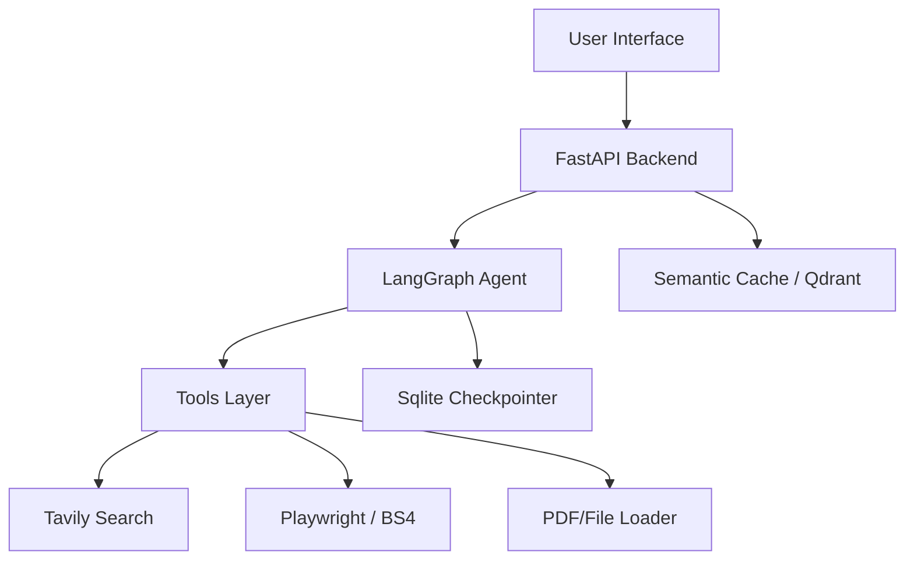

# aXk – Intelligence Engine (v2.1)


A powerful **Multimodal Agentic RAG System** powered by **Google Gemini 2.0 Flash**. This engine integrates real-time web scraping, document analysis (PDF/Images), and autonomous decision-making to provide grounded, citation-backed answers.

---

## 🚀 Key Features

### 🧠 **Agentic Core**
- **Orchestrator**: Built on **LangGraph** for stateful, cyclic agent workflows.
- **Multimodal**: Understands Text, PDFs, CSVs, and **Images** (Scanned Docs/Diagrams).
- **Tools**: Equipped with **Tavily Search** (Deep Web) and **Smart Scraper** (Context-aware).

### 🌐 **Smart Ingestion**
- **Dynamic Scraping**: Uses **Playwright** (Headless Browser) to render JS-heavy sites (e.g., Single Page Apps).
- **Robust Fallbacks**: Trafilatura -> BeautifulSoup -> Playwright 3-layer fallback system.
- **Parallel Processing**: Async processing for fetching multiple URLs simultaneously.

### 📊 **Analytics & UI**
- **Metric Dashboard**: Real-time **Token Usage**, **Latency**, and **Relevancy Score** (Cosine Similarity).
- **Session History**: Persists chat sessions (Sqlite) with a sidebar to switch between past conversations.
- **Interactive Suggestions**: "Deep Dive", "Summarize", and "Check Accuracy" buttons that retain context.

### 🔒 **Privacy & Safety**
- **Local State**: Chat history stored locally in `checkpoints.db`.
- **References**: Every claim is cited with its source (URL or Document Name).

---

## 🛠️ Tech Stack

- **LLM**: Google Gemini 2.0 Flash
- **Framework**: LangChain & LangGraph
- **Backend**: FastAPI (Async)
- **Frontend**: Streamlit
- **Vector Store**: Qdrant (Local/Memory) & SentenceTransformers
- **Scraping**: Trafilatura, BeautifulSoup4, Playwright

---

## 🔧 Installation

### 1. Clone Repository
```bash
git clone https://github.com/akarshankapoor7/aXk-Intelligence-Engine---Advance-Multimodal-Agentic-RAG-powered-by-Gemini-.git
cd aXk-Intelligence-Engine
```

### 2. Setup Environment
Create a `.env` file in the root directory:
```bash
GEMINI_API_KEY=your_google_api_key
TAVILY_API_KEY=your_tavily_api_key
LANGCHAIN_API_KEY=your_langsmith_key (Optional)
LANGCHAIN_TRACING_V2=true (Optional)
```

### 3. Install Dependencies
```bash
# Create Virtual Env
python -m venv .venv
source .venv/bin/activate  # Windows: .venv\Scripts\activate

# Install Browsers for Playwright
pip install -r requirements.txt
playwright install chromium
```

---

## 🏃‍♂️ Usage

### Start Backend (API)
The FastAPI server handles the Agent logic and orchestration.
```bash
uvicorn api.app:app --host 0.0.0.0 --port 8050 --reload
```
*API Docs available at: http://localhost:8050/docs*

### Start Frontend (UI)
The Streamlit interface for user interaction.
```bash
streamlit run frontend/streamlit_app.py
```
*Access UI at: http://localhost:8501*

---

## 🧪 Architecture



---

## 🤝 Contributing
Contributions are welcome! Please open an issue or submit a pull request.

## 📄 License
This project is licensed under the MIT License.
